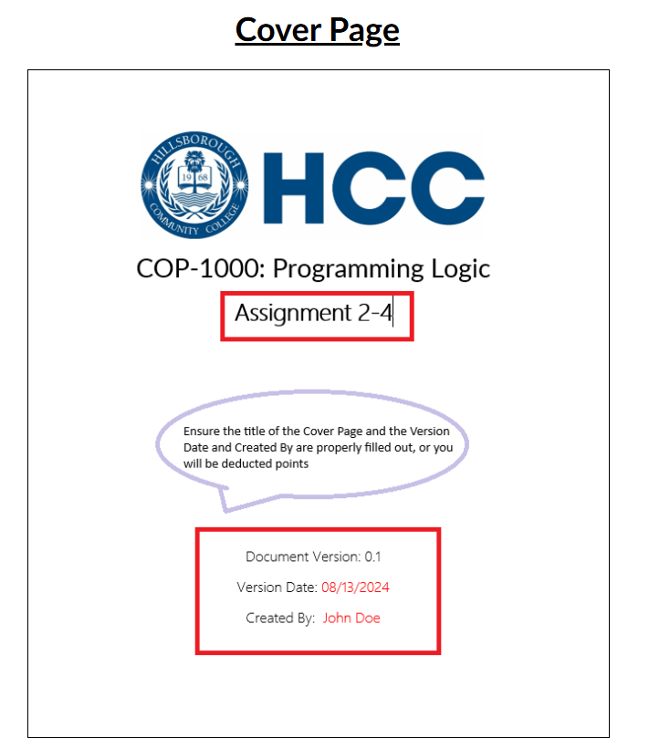
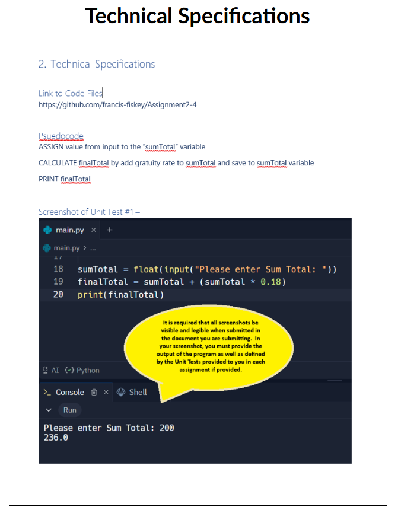

# Regarding assignment Submissions 

### Must follow the guidelines labeled by each assignment 
- Such as format requirements 
- Proper citation of sources 
- Clarity in writing 
- Submissions should be free of spelling and grammatical errors well organized presented in a way thtat reflects a serious commitment to academic work 

## Example includes a cover page

## Example includes Technical Document Page

