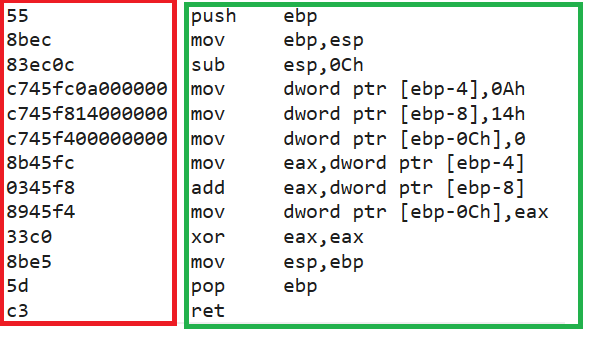

# Module 1 Notes 

## Lecture video

Programming - the process of writing instructions for a computer to execute.
- to create or develop software 
- contains instruction which a computer will execute to solve a problem 


## Computer Basics

### What is a computer?

A computer is a device that can be instructed to carry out sequences of arithmetic or logical operations automatically via computer programming. 
- Modern computers have the ability to follow generalized sets of operations, called programs. These programs enable computers to perform an extremely wide range of tasks.

A computer consists of a CPU, memory, hard disk, floppy disk, monitor, printer, and communication devices 

### CPU (Central Processing Unit) - the brain of the computer
- retrieves instructions from memroy and executes those instuctions  
- Hertz (Hz) - unit used to measure speed of a CPU
    - Hertz are a unit used to measure the frequency of periodic events, such as sound waves, light waves, and electromagnetic waves, such as radio waves.
    - Hertz are used to measure computer speed because the CPU complete processes in cucles. each cycle involves a basic task, such as fetching an instruction from memory or writing data to memory.
    Hertz provide a standardized way to measure the speed of a CPU.

### Memory - stores data and instructions that are currently being used by the CPU

-  a memory unit is an ordered sequence of bytes where each byte holds eight bits. A program and its data must be brought to memory before they can be executed
    - memory byte is never empty but its initial content may be meaningless to a program
    - information stored in a byte prior to being used by a program is called garbage and that garbage is lost when the byte is used by the program
- Memory is divided into two types: RAM and ROM
    - RAM (Random Access Memory) - temporary memory that stores data and instructions that are currently being used by the CPU
    - ROM (Read Only Memory) - permanent memory that stores data and instructions that are used by the computer to boot up

### How Data is stored
When data is saved to memory it is stored using a series of bits (zeroes and ones)
- a bit is the smallest unit of data in a computer
- any data that cannot be contained in one byte is stored in memory using multiple adjacent bytes 

### Storage Devices 
Storage devices are a necessity because memory is volatile. When power is lost to a computer, the data stored in memory is lost.  
This is where storage devies solve a problem. All data is stored on a storage device, which is non-volatile and when that data is needed it is brought into memory.

**Three types of storage devices**
- Hard Disk - stores data on a magnetic disk
- CD drives - which consist of a laser that reads data from a (CD-R or CD-RW)
- Flash drives - which store data on a memory chip

### Monitor
The monitor displays information (text and graphics) to the user and its quality is determing by its dot pitch and resolution.

- resolution - the number of pixels that can be displayed on the screen
    - pixels - (Short for picture elements are tiny dots that form an image on a screen 
- dot pitch - the distance between pixels on the screen, measured in millimeters


### Programs (Software)

Software is a set of instructions that tell a computer what to do and are written in programming languages.

- Programming languages are a means of writing instructions without having to use computer language to simplify the process of writing instructions to computers
    - Machine Language - the lowest level of programming language
    - Example of Machine Language 
    
    - Assembly Language - a low-level programming language that is a step above machine language
        - Assembly language requires a program called an assembler to convert the assembly language code into machine language
    - Example of Assembly Language
    
    - High-Level Language - a programming language that is easier to read and write than machine language 
        - High-level languages require a program called a compiler to convert the high-level language code into machine language

### Interpreting/ Compiling Source Code 
A program written in a high-level language is called source code. Source code is converted into machine language by a compiler or interpreter.  
An interpreter reads ons tatement from the source code, translates it to the machine code or virtual machine code, and then executes it right away 

**Compiling Source Code**  
A compiler translates the entire source code into a machine-code file whihc is then executed. 

### Operating Systems (OS)
- a program that manages and controls a computers activities
    - popular OS include Windows, Mac OS, and Linux
- Applicaiton Programs, such as a Web browser or word processor, run on top of the OS and rely on the OS to manage their activities

## Java Programming Language

Java is a high-level programming language that is platform-independent. This means that Java programs can run on any computer that has the Java Virtual Machine (JVM) installed.
- a general purpose programming language 
- Java is used to create applications for a wide range of devices, including computers, mobile phones, and embedded systems

### Java's History 
- Java was developed by Sun Microsystems in 1991 by a team led by James Gosling
- Java was originally called Oak, but was later renamed Java
Java was released on May 20th, 1995 at SunWorld Conference
- HotJava was the first web browser that could run Java applets
- [Learn More about Java](http://www.java.com/en/javahistory/index.jsp)

### Characteristics of Java
- Simple - Java is modeled on C++ and is designed to be easy to learn and use
- Object-Oriented - Java is an object-oriented programming language
- Distributed - Java is designed to work in a networked environment
- Interpreted - Java is compiled into byte code, which is then interpreted by the Java Virtual Machine
- Robust - Java is designed to be robust and reliable
    - compilers can detect errors in the code before the program is run
    - eleminated certain errors 
- Secure - Java is designed to be secure
    - Java programs run in a sandbox, which is a secure environment that prevents the program from accessing the system
- Architecture-neutral - Java is designed to be architecture-neutral and capable of running on any computer
- Portable - Java is designed to be portable and capable of running on any computer
- High-performance - Java does not need to be recompiled when used across different OS or hardware
- Multithreaded - Java is designed to be multithreaded, which means that it can execute multiple threads at the same time
    - threads are lightweight processes that run within a program
    - an example of a thread is a program that can download a file while the user is working on a document
- Dynamic - Java is designed to be dynamic and capable of adapting to changing conditions on the fly 


### Anatomy of a Java Program

**Class name** - a class name is the name of the program
- Every Java program must have a class name
- standard naming convention is to use a capital letter for the first letter of the class name
- the class name must match the name of the file  
    **Example**
    ```java
    // This program prints "Hello, World!" to the console
    public class HelloWorld {
        public static void main(String[] args) {
            System.out.println("Hello, World!");
        }
    }
    ```

**Main method** - the main method is the entry point of the program
- the program is executed from the main method 
- the main method is defined as follows:  
**Example**
    ```java
    public static void main(String[] args) {
        // code goes here
    }
    ```

**Statements** - statements are the instructions that the program executes and represent an action or sequence of actions
- statements are enclosed in curly braces  
**Example**
    ```java
    System.out.println("Hello, World!");
    ```
    - This statement prints ```"Hello, World!"``` to the console
    - ```System.out``` is a class that provides access to the system console
    - ```println``` is a method that prints a line of text to the console
- **Statement Terminator** - a statement terminator is a semicolon that is used to mark the end of a statement `;`


**Reserve words** - words that have special meaning in Java and cannot be used as identifiers. 
- `this`, `public`, `static`, `void`, `class`, and `main` are examples of reserved words

**Comments** - comments are used to document the program and are ignored by the compiler
- comments can be single-line or multi-line
- single-line comments are denoted by `//`
- multi-line comments are denoted by `/*` and `*/`

**Blocks**-   a block is a group of statements that are enclosed in curly braces  
- blocks are used to group statements together
- blocks can be nested within other blocks
    **Example**
    ```java
    {
        System.out.println("Hello, World!");
    }
    ```

**Whitespace**- whitespace is used to separate tokens in the program
    - whitespace is ignored by the compiler
    - whitespace includes spaces, tabs, and newlines


## Programming Style and Documentation 

### Appropriate Comments

A summary at the beginnning of a program explains what a program does, its key freatures, its supporting data strutures, and any unique techniques it uses to solve problems.
- include the name, class section, instructor, data and a brief description of the program. 

### Naming Conventions

Meaningful and descriptive names are helpful when naming variables, functions, classes, and other identifiers in a program.
- simplicity is more effective than colorful and fun
- names should imply what they are for or their purpose making them easily identifiable

### Indentation and Spacing

Indentation and spacing are used to make the code more readable and easier to understand.
- unlike other languages, Java does not require indentation, but it is a good practice to use it
    - indentation is used to show the structure of the program
    - indentation is used to show the relationship between blocks of code
    - 4 spaces is easier to read and make sense of than two 
- use blank lines to seperate segments of code that are related to each other

### Block Styles 
- Use end of lines style for braces  
    **Example: End-line style**
    ```java
    public class HelloWorld {
        public static void main(String[] args) 
        {
            System.out.println("Hello, World!");
        }
    }
    ```
    **Example: Next-line style**
    ```java
    public class HelloWorld 
    {
        public static void main(String[] args) 
        {
            System.out.println("Hello, World!");
        }
    }
    ```

### Errors
**Syntax Errors** - errors that occur when the rules of the programming language are not followed
- syntax errors are detected by the compiler and must be fixed before the program can be run

**Runtime Errors** - errors that occur when the program is running
- runtime errors are not detected by the compiler and can cause the program to crash or produce incorrect results

**Logic Errors** - errors that occur when the program does not produce the expected results
- logic errors are not detected by the compiler and must be fixed by the programmer
    